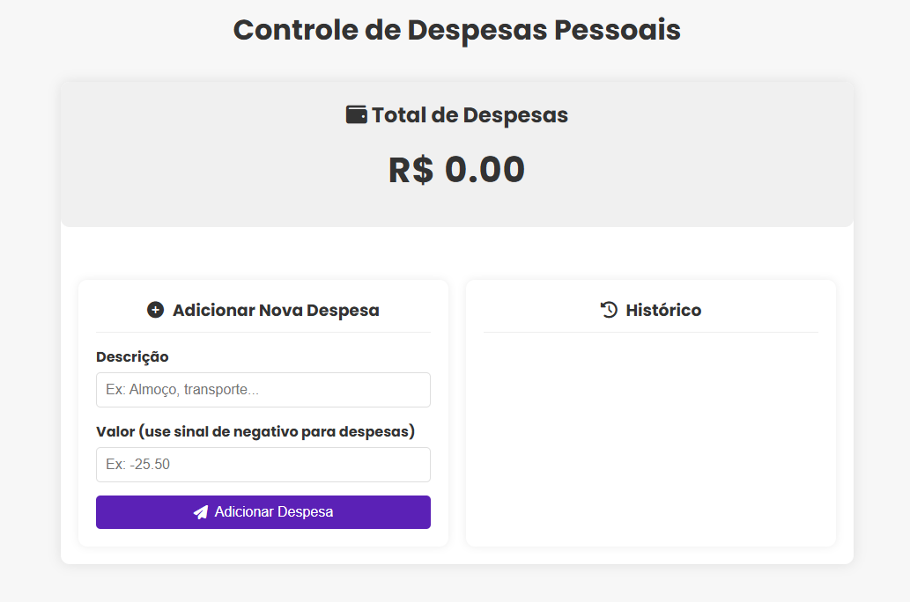

# Controle de Despesas Pessoais

## 📝 Sobre o Projeto

Uma aplicação web simples para controle de despesas pessoais, que permite ao usuário adicionar, visualizar e remover transações. O valor total das despesas é calculado e atualizado automaticamente.

Este projeto foi desenvolvido como parte da avaliação da disciplina de **Desenvolvimento de Sistemas Web** da **Universidade Federal de Itajubá (UNIFEI)**. O objetivo principal é demonstrar conhecimentos fundamentais em HTML, CSS e JavaScript para a criação de uma aplicação front-end interativa e funcional, com persistência de dados no lado do cliente utilizando `Local Storage`.

## 🖼️ Screenshot

## ✨ Funcionalidades

-   **Adicionar despesas:** Formulário para inserir a descrição e o valor de uma nova despesa.
-   **Listar despesas:** Histórico de todas as transações adicionadas.
-   **Calcular total:** O valor total gasto é exibido e atualizado em tempo real.
-   **Remover despesas:** É possível excluir transações individuais do histórico.
-   **Persistência de dados:** As despesas são salvas no `Local Storage` do navegador, portanto, os dados não são perdidos ao fechar ou recarregar a página.
-   **Layout Responsivo:** A interface se adapta a diferentes tamanhos de tela (desktop e mobile).

## 🚀 Tecnologias Utilizadas

-   **HTML5:** Para a estruturação semântica do conteúdo.
-   **CSS3:** Para a estilização, layout e responsividade, com uso intensivo de **Flexbox** e **Media Queries**.
-   **JavaScript:** Para a manipulação do DOM, gerenciamento de eventos e toda a lógica da aplicação.
-   **Font Awesome:** Para a inclusão de ícones, melhorando a experiência visual do usuário.

## 📂 Estrutura e Código

O projeto é organizado em três arquivos principais, seguindo a separação de responsabilidades:

### 📄 `index.html`

Responsável pela estrutura principal da página. Utiliza tags semânticas como `<header>`, `<main>` e `<section>` para uma melhor organização e acessibilidade. O corpo do documento é dividido em:
-   Um cabeçalho com o título da aplicação.
-   Uma seção para exibir o saldo total.
-   Um container (`div.content-wrapper`) que agrupa o formulário de adição e a lista de histórico.
-   Link para a biblioteca de ícones **Font Awesome**.

### 🎨 `style.css`

Responsável por toda a parte visual e de layout. As principais características são:
-   **Design Moderno:** Utiliza a fonte "Poppins" do Google Fonts e um esquema de cores limpo.
-   **Layout Responsivo (Mobile-First):** Por padrão, os elementos são dispostos em coluna. Em telas maiores (a partir de 768px), o layout muda para duas colunas (formulário e histórico lado a lado) através de uma `@media query`.
-   **Flexbox:** Usado para alinhar e distribuir os elementos de forma flexível e eficiente.
-   **Efeitos de Interação:** Efeitos de `hover` em botões e nos itens da lista para melhorar a usabilidade, como o botão de exclusão que desliza para a tela.

### 💻 `script.js`

O cérebro da aplicação, controlando toda a interatividade e manipulação de dados. Suas principais responsabilidades incluem:
-   **Manipulação do DOM:** Seleciona os elementos HTML necessários para interagir com a página.
-   **Gerenciamento de Eventos:** Captura o evento de `submit` do formulário para adicionar novas transações.
-   **Lógica de Negócio:**
    -   Funções para adicionar, remover e renderizar transações na tela.
    -   Função para calcular e atualizar o saldo total.
-   **Persistência com `Local Storage`:**
    -   Ao iniciar, a aplicação verifica se há dados salvos no `Local Storage` e os carrega.
    -   Toda vez que uma transação é adicionada ou removida, o `Local Storage` é atualizado com a lista mais recente.

## 🏁 Como Executar Localmente

1.  Clone este repositório ou baixe os arquivos em uma pasta.
2.  Navegue até a pasta do projeto.
3.  Abra o arquivo `index.html` em qualquer navegador web moderno.

---
